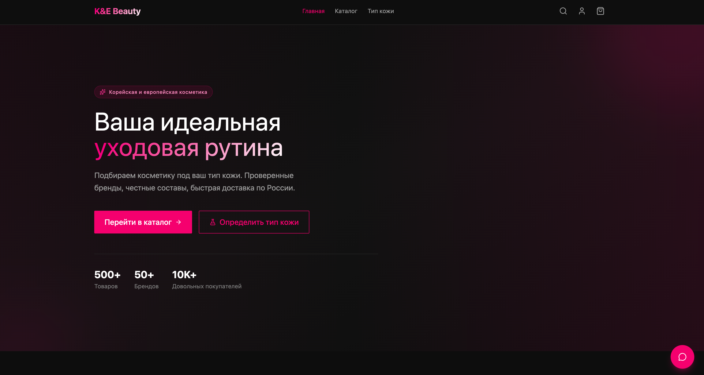
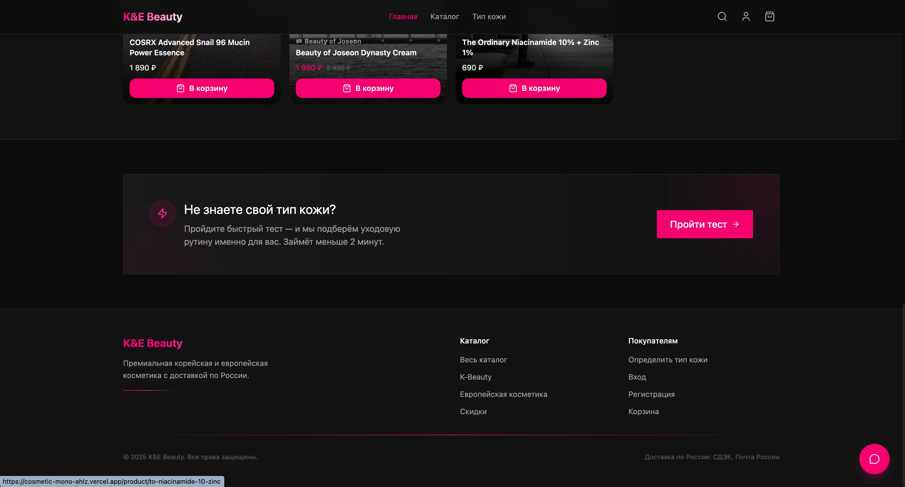
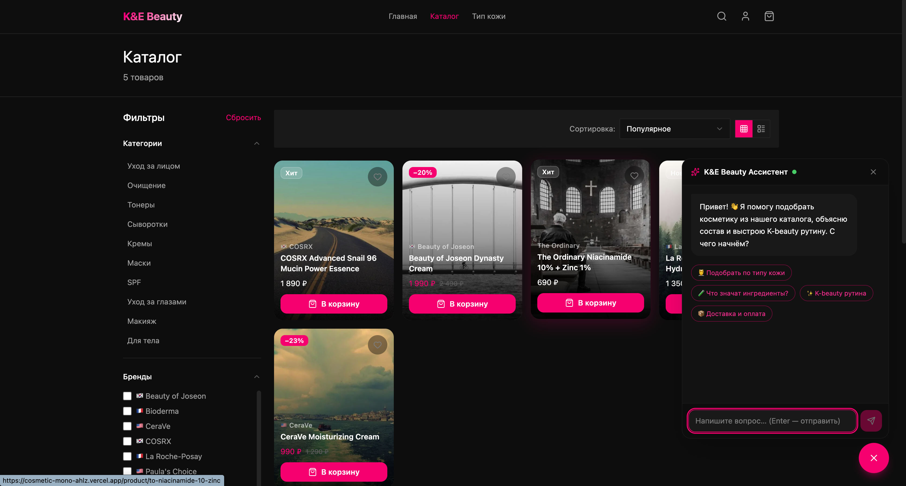

# Cosmetics E-Commerce Platform

> Full-stack e-commerce application for a cosmetics store targeting Russian-speaking markets. Built with Feature-Sliced Design architecture, AI-powered product assistant, and YooKassa payment integration.

## Screenshots





---

## Features

- **Product catalog** — filtering, search modal, pagination, product detail pages
- **AI chat assistant** — RAG-based chat powered by Groq (llama-3.3-70b), searches real products before answering
- **Skin type quiz** — interactive questionnaire that recommends products based on skin type
- **Routine builder** — personalized skincare routine widget
- **Cart & wishlist** — Zustand-powered state with persistent storage
- **Checkout flow** — multi-step stepper (address → promo code → payment)
- **YooKassa payments** — full integration with webhook handling
- **Auth** — Supabase Auth with Google OAuth support
- **User profile** — order history, wishlist, account settings
- **Admin panel** — manage products, categories, brands, orders, promo codes, analytics
- **SEO** — dynamic sitemap, robots.txt, AI-generated meta descriptions

---

## Tech Stack

| Layer | Technology |
|---|---|
| Framework | Next.js 15 (App Router) |
| Language | TypeScript |
| Architecture | Feature-Sliced Design (FSD) |
| Styling | Tailwind CSS |
| State | Zustand + TanStack React Query |
| Database | Supabase (PostgreSQL) |
| Auth | Supabase Auth + Google OAuth |
| AI | Groq SDK — llama-3.3-70b-versatile |
| Payments | YooKassa |
| Validation | Zod |
| Deployment | Vercel |

---

## Project Structure

Follows [Feature-Sliced Design](https://feature-sliced.design/) methodology:

```
apps/web/src/
├── app/              # Next.js App Router — pages & API routes
│   ├── (auth)/       # Login, register
│   ├── (store)/      # Catalog, product, cart, checkout, profile
│   ├── admin/        # Admin panel
│   └── api/          # REST endpoints (chat, orders, yookassa webhook)
├── views/            # Page-level UI compositions
├── widgets/          # Independent UI blocks (header, cart drawer, chat)
├── features/         # Business logic units (auth, cart, checkout, quiz, search)
├── entities/         # Domain models (product, order, user, brand, review)
└── shared/           # Reusable UI, hooks, lib, config, types
```

---

## AI Chat Assistant

The chat endpoint (`/api/chat`) implements a RAG pattern:

1. Detects skin type keywords in the user message
2. Fetches relevant products from Supabase
3. Injects product data as context into the Groq prompt
4. Streams the response back to the client

```
POST /api/chat
Body: { messages: [{ role: "user", content: "..." }] }
Response: streaming text/plain
```

---

## Getting Started

### Prerequisites

- Node.js 18+
- Supabase project
- Groq API key ([console.groq.com](https://console.groq.com))
- YooKassa account (for payments)

### Installation

```bash
git clone https://github.com/Nikolanikol/cosmetic_mono.git
cd cosmetic_mono
cd apps/web && npm install
```

### Environment Variables

Create `apps/web/.env.local`:

```env
# Supabase
NEXT_PUBLIC_SUPABASE_URL=your_supabase_url
NEXT_PUBLIC_SUPABASE_ANON_KEY=your_supabase_anon_key
SUPABASE_SERVICE_ROLE_KEY=your_service_role_key

# Groq AI
GROQ_API_KEY=your_groq_api_key

# YooKassa
YOOKASSA_SHOP_ID=your_shop_id
YOOKASSA_SECRET_KEY=your_secret_key
YOOKASSA_WEBHOOK_SECRET=your_webhook_secret

# App
NEXT_PUBLIC_APP_URL=http://localhost:3000
```

### Run

```bash
cd apps/web
npm run dev
```

Open [http://localhost:3000](http://localhost:3000)

---

## Admin Panel

Available at `/admin`. Requires admin role in Supabase.

Sections: Dashboard · Products · Categories · Brands · Orders · Promo Codes · Analytics

---

## License

Private commercial project. All rights reserved.
